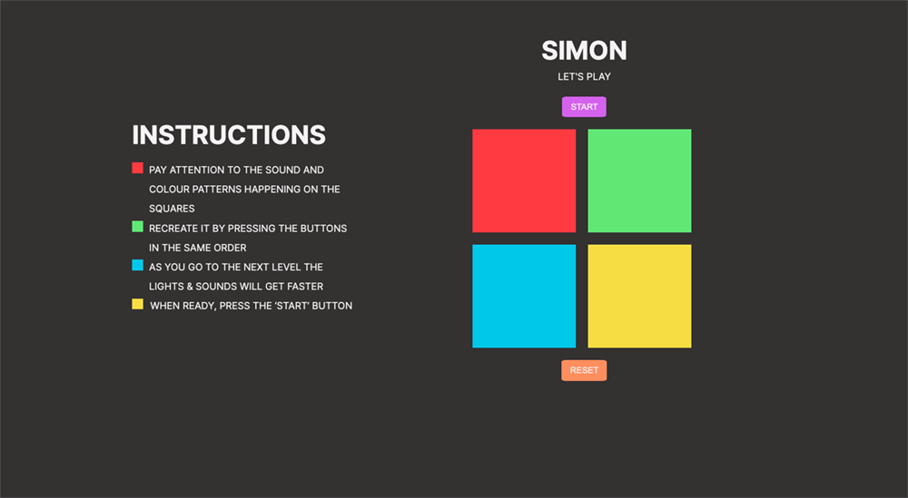
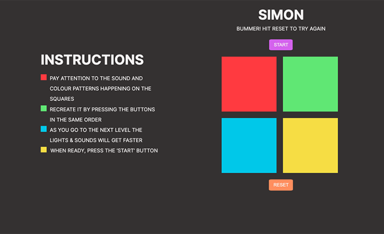
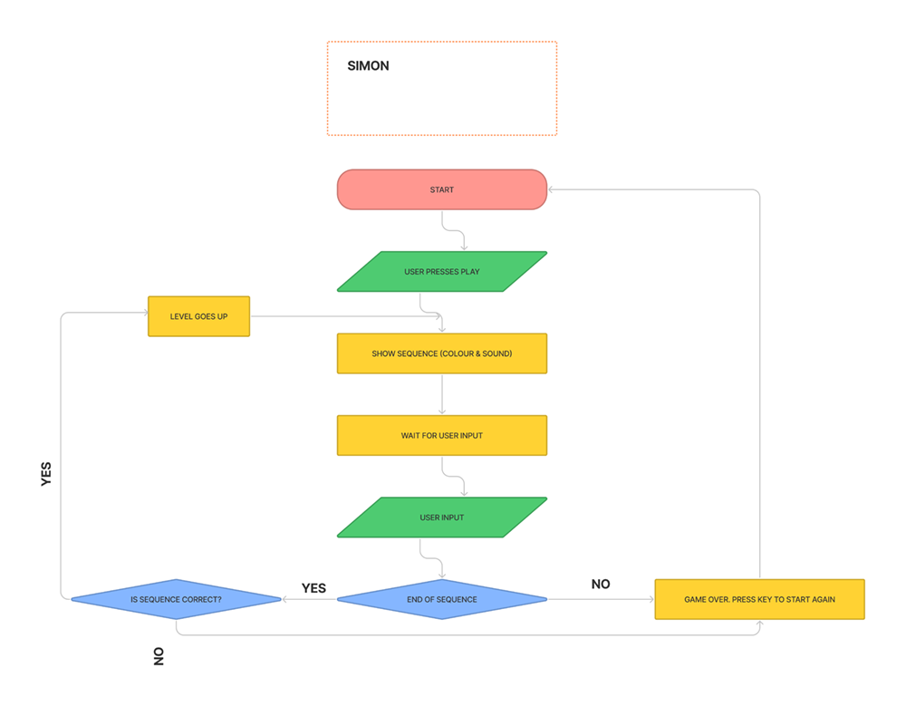
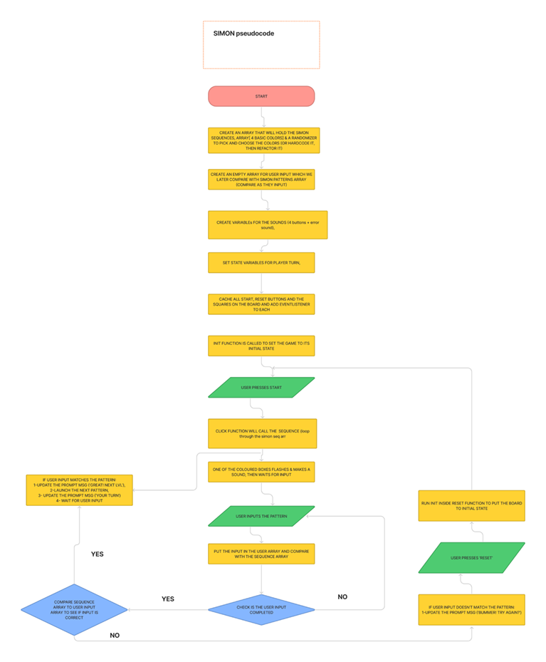

# Simon - Browser Game

## Description

The goal of the game is to click on the button as they light up, in the correct order. This game only has strict mode, meaning if you make one mistake you loose and need to restart from the beginning. 
If the player can go all the way to level 10 they win the game.

## Screenshots of the Game

## Flowchart

Flowchart for game play

## Pseudocode

